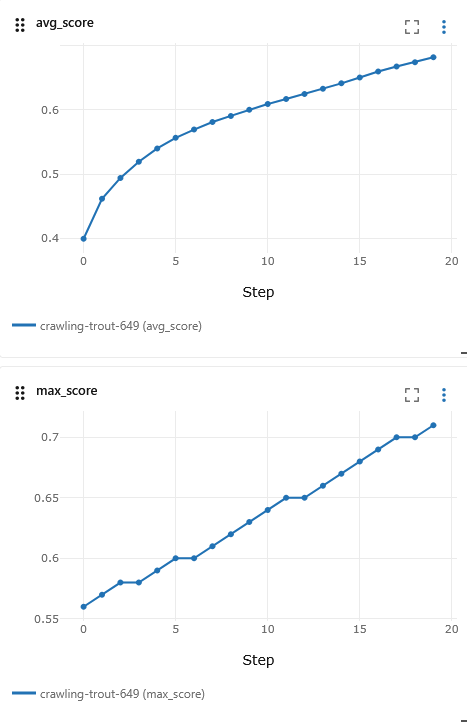

# Protein_generation_lakehouse

RL + Diffusion + Flow Matching + MLflow on a Lakehouse Architecture


Here,  I built an end-to-end ML pipeline where protein sequences are generated using RL/diffusion-inspired models, stored in a lakehouse architecture (bronze/silver/gold), scored and iteratively improved through a training loop, with experiment tracking using MLflow.


# Overview
This project implements an end-to-end AI-driven protein sequence generation platform combining:

* Reinforcement Learning (sequence optimization)
* Diffusion-inspired generation (iterative denoising)
* Flow matching (continuous sequence interpolation)
* Lakehouse data architecture
* Experiment tracking with MLflow

# Tech stack
- Databricks
- Apache Spark / PySpark
- Delta Lake
- MLflow

# Project Goal

```plaintext
Generate → Score → Track → Select → Improve → Repeat
```

# workflow
```plaintext
AI Models → Bronze (raw) → Silver (scored) → Gold (top sequences)
                     ↓
                  MLflow (experiments, metrics, params)
```

The structure of repository would be like:
```plaintext

protein-generation-lakehouse/
│
├── data/
│   ├── bronze/
│   ├── silver/
│   └── gold/
│
├── models/
│   ├── rl_generator.py
│   ├── diffusion_generator.py
│   ├── flow_matching.py
│
├── pipeline/
│   ├── 01_generate.py
│   ├── 02_score.py
│   ├── 03_select.py
│   ├── 04_train_loop.py
│
├── tracking/
│   ├── mlflow_utils.py
│
├── utils/
│   ├── scoring.py
│
├── notebooks/
│   demo_notebook.ipynb
│
├── requirements.txt
└── README.md

```

# setup
```plaintext
Tested on:
- Python 3.10
- Java 17

pyspark==3.4.2
delta-spark
mlflow
numpy
pandas
```


# 📈 MLflow Tracks
 Parameters:
 - iterations
 - population size
 Metrics:
 - average score per iteration
 - max score per iteration

# 👉 Databricks:
* experiment dashboard
* performance curves

# Lakehouse layers
| Layer  | Purpose                 |
| ------ | ----------------------- |
| Bronze | Raw generated sequences |
| Silver | Scored sequences        |
| Gold   | Top candidates          |


# Big picture
This is a data+ ML system 
```bash
Generate data → Store → Process → Score → Select → Train → Track
```


# data
<details>
<summary>Data generation and training Loop</summary>
1. We generate protein sequence data using 
```python
pipeline/01_generate.py
```
 
The generated synthetic data:
```python
e.g., generate_sequence() → "ACDEFGHIK..."
```

We saved this data in (data/bronze/sequences) which is the bronze layer.

- Raw data
- No processing
- Just generated sequences

2. We process data with
```python
pipeline/02_score.py
```
 
- read raw data
- Apply score function

```python
e.g., score_sequence("ACDEFGHIK...") -> score = 0.63
```

We saved this data in (data/silver/sequences) which is the silver layer.

- Cleaned + processed data
- Now has features (scores)

3. We filter and select best data with
```python
pipeline/03_select.py
```
 
- Sort sequences by score
- Keep top ones


We store this data in (data/gold/top_sequences) which is the gold layer.

- High-quality data
- Ready for modeling / decision-making

4. ML model

```python
models/
```
we have :

- rl_generator.py → Reinforcement Learning (mutation/improvement)
- diffusion_generator.py → noise + denoise
- flow_matching.py → sequence interpolation

They generate new protein sequences.

5. ML model training

```python
pipeline/04_train_loop.py
```

Loop:

```plaintext
1. Generate sequences
2. Score them
3. Select best
4. Mutate (RL step)
5. Repeat
```

- RL = improves sequences over time
- Not traditional “fit(X, y)”
- More like optimization loop

6. experiment tracking

by using MLflow:
```python
tracking/mlflow_utils.py
```

what is tracked;

- Parameters (iterations, population)
- Metrics:
     - avg score
     - max score

We can see model improving over time.


7. Data engineering (This version)

by using 
```plaintext
PySpark
Delta Lake
```

What Spark does:
- Handles large datasets
- Reads/writes data
- Scales processing


Example:
```python
df.write.mode("overwrite").parquet(...)
```

8. Full workflow:

```plaintext
        ┌──────────────┐
        │ ML Models    │  (RL / Diffusion / Flow)
        └──────┬───────┘
               ↓
      01_generate.py
               ↓
        Bronze Layer
   data/bronze/sequences
               ↓
      02_score.py
               ↓
        Silver Layer
   data/silver/sequences
               ↓
      03_select.py
               ↓
         Gold Layer
   data/gold/top_sequences
               ↓
      04_train_loop.py
               ↓
          MLflow Tracking

```

The full ML system does:

- data generation
- pipelines
- storage layers
- iterative training
- tracking
</details>


# How to run
<details>
<summary> Full set up </summary>
After cloning the  project and create environment:

```bash
git clone protein-generation-lakehouse
cd protein-generation-lakehouse
pip install -r requirements.txt
```

There was incompatibility error between JDK and pyspark. We created an env with python 3.10 and also downloaded JDK 17 from [Eclipse Adoptium](https://adoptium.net/temurin/releases/?version=17).
To check Java version:
```bash
java -version
```

After issues with pyspark, hadoop and Java version on windows (You can check full steps on [issue 1-3](https://github.com/SalmaKazemiRashed/Protein_generation_lakehouse/issues?q=is%3Aissue%20state%3Aclosed))
I had to move to WSL or linux.

We are following:
```bash
Generator Model
    ↓
Raw sequences
    ↓
Spark DataFrame
    ↓
Parquet / Delta Lake
    ↓
Feature engineering
    ↓
Training / evaluation

```

By running generation function:
```bash
python3 -m pipeline.generate
```

We have Sample Generated Proteins:
```plaintext
+----------+--------------------------------------------------+--------------------------------------------------+---------+---------------+-------------------+
|protein_id|sequence                                          |optimized_sequence                                |rl_reward|diffusion_score|flow_matching_score|
+----------+--------------------------------------------------+--------------------------------------------------+---------+---------------+-------------------+
|0         |ELGTFLEDDTQAWWIPNTQFHAIVWVVGYTRISFFQGYTKQWFKDWIETF|ELGTFLEDDTQAWWIPNTQFHAIVWVVGYTRISFFQGYTKQWFKDWIETH|0.82     |0.9            |0.662              |
|1         |TYQIAWGPRYCMFWQWINADNYQWPNNMGMHVRIQNGELKMSLAHKTCDQ|TYQIAWGPRYCMFWQWINADNYQWPNNMGMHVRIQNGWLKMSLAHKTCDQ|0.849    |0.615          |0.784              |
|2         |LTGVRRVAGMPLFFITVWYPLCDCGYVCKWHKIKFQACQNPPIYTMENNA|LTGVRRVAGMPLFFITVWYPLCDCGYVCPWHKIKFQACQNPPIYTMENNA|0.817    |0.866          |0.765              |
|3         |WMNADYTPTESLCNGVSVCCNFYIIAHSLIRRDCHSYFKEWTCLVWISSN|WMNADYTPTESLCNGVSVCCNFYIIAHSLIRRDCHSYFKEWTCLVWISSL|0.909    |0.77           |0.627              |
|4         |SLHTPPCMSMGKEQHWDPIMHLYIRNVTQCWDGPYNPNIMIESMMQTSFC|SLHTPPCMSMGKEQHWDPIMHLYIRNVTQCWDGPYNPNIMIESMMQTSFC|0.942    |0.91           |0.936              |
|5         |CWTRGRCAVPCISTRESHFIQQWEKTWPVHWTPQLIKDTLGSCCTKEFAN|CWTRGRCAVPDISTRESHFIQQWEKTWPVHWTPQLIKDTLGSCCTKEFAN|0.994    |0.85           |0.985              |
|6         |IINSDESDDTNCDCVFCPMTESGVQYTSTTTTNGLWTGGYGVIAILWELM|IINSDESDDTNCDCVFCPMTESGVQYTSTTTTNHLWTGGYGVIAILWELM|0.816    |0.987          |0.576              |
|7         |HAEVQITQRAACNDHNRNHVFEEPTIYDCQTEMAMVTFTREKTDAWYKKC|HAEVQITQRAACNVHNRNHVFEEPTIYDCQTEMAMVTFTREKTDAWYKKC|0.931    |0.672          |0.71               |
|8         |YHTDIYRGTAVYRRDKRFEQCYIGLAWKMQVSTTADEASHMNSFAWTSNP|YHTDIYRGTFVYRRDKRFEQCYIGLAWKMQVSTTADEASHMNSFAWTSNP|0.72     |0.657          |0.787              |
|9         |DMRHYWCCDMYCNKCFRRRGMDARFRQQTLWGQTKKAFGDKQHVTERLYQ|DMRHYWCCDMYCNKCFKRRGMDARFRQQTLWGQTKKAFGDKQHVTERLYQ|0.879    |0.693          |0.797              |
+----------+--------------------------------------------------+--------------------------------------------------+---------+---------------+-------------------+
```

regrading the scores column what we have here:
```plaintext
| Score               | Real meaning                        | MY implementation |
| ------------------- | ----------------------------------- | ------------------- |
| diffusion_score     | model denoising likelihood / energy | random number       |
| flow_matching_score | vector-field consistency            | random number       |
| rl_reward           | optimization signal                 | random number       |

```
After running
```bash
python3 -m pipeline.02_score
```
Scored Proteins are:

```plaintext
+----------+--------------------------------------------------+--------------------------------------------------+---------+---------------+-------------------+-----+
|protein_id|sequence                                          |optimized_sequence                                |rl_reward|diffusion_score|flow_matching_score|score|
+----------+--------------------------------------------------+--------------------------------------------------+---------+---------------+-------------------+-----+
|913       |VQMATCQYNVIQEVYNTLYKKVPSWRRHVLYWCIQDSSDKCKPSHDWYMN|VQMATCQYNVIQEVYNTLYKKVPSWRRHVIYWCIQDSSDKCKPSHDWYMN|0.746    |0.73           |0.738              |0.4  |
|914       |KPIAHTWLVCKREYTYTREMWCSWTATCMNVLGGYFTSVVMVGVPKPGDT|KPIAHTWLVCKREYTYTREMWCSWTATCMNVLGGYFTVVVMVGVPKPGDT|0.891    |0.793          |0.978              |0.44 |
|915       |VKSNAGHPWCIYGIILQMNYSKYMCNLEKHMVIKFESQVQFGQKGSWRRY|VKSNAGHPWCIYFIILQMNYSKYMCNLEKHMVIKFESQVQFGQKGSWRRY|0.935    |0.696          |0.781              |0.44 |
|916       |HNRNGAEFGCGWGGWWPVFFQQYECMKYKTNTMIHATVGGQSTKWTFHWH|HNRNGAEFGCGWGGWWPVFFQQYECMKYKTNLMIHATVGGQSTKWTFHWH|0.989    |0.823          |0.618              |0.38 |
|917       |HSRLACMYNAAWHRYMHMRVNTKGKTLNCANRSLLALIPTFDITVECKMQ|HSRLACMYNAAWHRYMVMRVNTKGKTLNCANRSLLALIPTFDITVECKMQ|0.84     |0.896          |0.96               |0.46 |
|918       |KHKGCCSHNDKRVTDSEASQNSEDGAYCIVNDGTSHERQGSIMEVKVDFG|KHKGCCSHNDKRVTDSEASQNSEDGAYCIVNDGTSHERQGSIMAVKVDFG|0.923    |0.805          |0.648              |0.24 |
|919       |DMASTGSVRESFIDVLNLRQTKPYEYEDLHHPKVYPNKMLIYRCLSALCM|DMASTGSVRESFIDVLNLRQTKPYEYEDLHHPKVYPNKGLIYRCLSALCM|0.771    |0.968          |0.875              |0.4  |
|920       |VVQYCMSSLIDRITLNAHTAHCVWVWKIFPQCKFTSLATLVCHMQIMRHD|VVQYCMSSLIDRITLNAHTAHCVWVWKIFPQCKFTSLVTLVCHMQIMRHD|0.89     |0.818          |0.793              |0.48 |
|921       |FGGVYTCGHNCNYVLYWCYQVPWGQCLTPEFDYSSMWKMHVWSCGCWRYF|FGGCYTCGHNCNYVLYWCYQVPWGQCLTPEFDYSSMWKMHVWSCGCWRYF|0.743    |0.888          |0.813              |0.42 |
|922       |LKHKMEWVGIHSSKMYHMLSDIIPERQICVGWICILHMWMPRKGKCMFRA|LKHKMEWVGIQSSKMYHMLSDIIPERQICVGWICILHMWMPRKGKCMFRA|0.996    |0.783          |0.527              |0.46 |
+----------+--------------------------------------------------+--------------------------------------------------+---------+---------------+-------------------+-----+
```
We have calculated score here based on hydrophobicity of proteins based on hydrophobic Amino acids which are 

```bash
hydrophobic = "AILMFWYV".
```

Now what we have in data/silver/ layers is after scoring:
```plaintext
| Column              | Meaning                |
| ------------------- | ---------------------- |
| sequence            | original protein       |
| optimized_sequence  | RL-mutated version     |
| rl_reward           | optimization quality   |
| diffusion_score     | generative confidence  |
| flow_matching_score | trajectory consistency |
| score               | hydrophobicity ratio   |
```

After filtering the sequences we have gold layer as:

Top Ranked Proteins:
```plaintext
+----------+--------------------------------------------------+--------------------------------------------------+---------+---------------+-------------------+-----+------------------+
|protein_id|sequence                                          |optimized_sequence                                |rl_reward|diffusion_score|flow_matching_score|score|final_score       |
+----------+--------------------------------------------------+--------------------------------------------------+---------+---------------+-------------------+-----+------------------+
|786       |PQGVLPGHGYMSKPTELHKIFWVQKVNVYYAQVQALNEVMERVVDRSCTA|PQGVLPGHGYMSKPTEFHKIFWVQKVNVYYAQVQALNEVMERVVDRSCTA|0.999    |0.926          |0.976              |0.44 |0.868             |
|583       |FQCDGVTRPDGCLVWSIYIEDVFMRQNVGFLQWNQGPLYVNMQIRKARKM|FQCDGVTRPDGPLVWSIYIEDVFMRQNVGFLQWNQGPLYVNMQIRKARKM|0.977    |0.975          |0.957              |0.44 |0.8652000000000001|
|635       |TPKMMFGYIHWKCCFMSYLYGWALVSWMYSTTRGGPSCNTHTSVIMMYPT|TPKMMFGYIHWKCCFMMYLYGWALVSWMYSTTRGGPSCNTHTSVIMMYPT|0.992    |0.995          |0.867              |0.48 |0.8652000000000001|
|751       |QKVCFIAKMPYEERPVLYCETKDPEHYKQDEMYTLWAMSDIWIHHQYHTT|QKVCFIAKMPYEERPVLYCETKDPEHYKQDEMYTLWAMSDIWICHQYHTT|0.977    |0.973          |0.991              |0.4  |0.8636000000000001|
|405       |GSPMVYGMDWNNEFQAKDPSPIGCFQTNNLSDHIFCYKQMEISAAVTSGR|GSPMVYGMDWNNEMQAKDPSPIGCFQTNNLSDHIFCYKQMEISAAVTSGR|0.999    |0.966          |0.946              |0.36 |0.854             |
|832       |VMMLGKNTNESVLHVALYIITTPSSAYQVIREGCFQNIYRKMFQTEYFFT|VMMLGKNTNESVLHVALYIITTPSSAYQVIREGCFQNIYRKMFQTEYFFT|0.919    |0.974          |0.973              |0.48 |0.853             |
|671       |MHFNNIQFGVRVGYGRSNFGLRKLGNLIHSEAEDSLEWPNKWHLKYLMIV|MHFNNIQFGVRVGYGRSNFGLRKLGNLIHSEIEDSLEWPNKWHLKYLMIV|0.948    |0.944          |0.983              |0.44 |0.8525999999999999|
|395       |MDEDIIVWARMCVVASHVWKACDWGGKCERKMFQLLTKYGSRFIFIFLWV|MDEDIIVWARMCVVASHVWKACDWGGKCERKMFQLLTKYGSRFIFIFLMV|0.942    |0.854          |0.981              |0.54 |0.8518000000000001|
|214       |YWYDGQYHFEAFLWNLEFFPCMENNVSDQGLYSKYMSDECYVRFHILMND|YWYDGQYHFEAFLWNLEFFPCMENNVSDQGLYSKYMSDECYVVFHILMND|0.977    |0.875          |0.913              |0.5  |0.8484            |
|819       |IWCWWFKSNCWMWLPSAQQRMMIFESLYQTDGLSFYICYFMNGFMQQGGM|IWCWWFKSICWMWLPSAQQRMMIFESLYQTDGLSFYICYFMNGFMQQGGM|0.968    |0.869          |0.892              |0.54 |0.8473999999999999|
|421       |FPQERFVNYDDEATMFLYGLQYSQRWWDLNLSNWLDEKGRWMGTNFWTDR|FPQERFVNYDDEATMFLYGLQYSQRWWDLNLSNWLDEKGRWMGTNFITDR|0.972    |0.911          |0.933              |0.42 |0.8416            |
|338       |VRFYNQSPWHAKCTNYWGPGMQKNAGSGTNSNCGASRMLAEERHFIKKSF|VRFYNQSPWHAKCTNYWGPGMQKNAGSGTNSNCTASRMLAEERHFIKKSF|0.953    |0.996          |0.984              |0.32 |0.8412            |
|567       |WLNFHYKIWDVRTSKQWDKQSPHIHQMTFFMACYQFIRYCGTHWDFKWSN|WLNFHYKWWDVRTSKQWDKQSPHIHQMTFFMACYQFIRYCGTHWDFKWSN|0.989    |0.881          |0.914              |0.42 |0.8386000000000001|
+----------+--------------------------------------------------+--------------------------------------------------+---------+---------------+-------------------+-----+------------------+
```

Here we have 


```plaintext
| Layer  | Purpose                        |
| ------ | ------------------------------ |
| Bronze | raw generated proteins         |
| Silver | scored/enriched proteins       |
| Gold   | ranked high-quality candidates |
```

## Data engineering layer

```bash
01_generation.py
02_score.py
03_select.py

```
## ML optimization layer
```bash
04_train_loop.py
```
MLflow will track:

- iterations
- population size
- top_k
- avg_score per iteration
- max_score per iteration
- final_best_score

```plaintext
Iteration 1 | Avg Score: 0.401 | Max Score: 0.620
Iteration 2 | Avg Score: 0.496 | Max Score: 0.640
Iteration 3 | Avg Score: 0.547 | Max Score: 0.640
Iteration 4 | Avg Score: 0.590 | Max Score: 0.660
Iteration 5 | Avg Score: 0.619 | Max Score: 0.680
```

## Experiment tracking layer
```bash
mlflow
```

After training the model for couple of iterations, we saved the logs in mlflow.db
```python
db_path = os.path.abspath("mlflow.db")

mlflow.set_tracking_uri(
    f"sqlite:///{db_path}"
)
mlflow.set_experiment("protein_generation_rl")
```

mlflow.db file can be checked through 
```bash
sqlite3 mlflow.db
```
and SQL commands such as 

```bash
SELECT experiment_id, name FROM experiments;
or 

SELECT key, value, step FROM metrics;
....
```
Also, mlflow logs could be reached locally through http://127.0.0.1:5000 after:

```bash
mlflow ui --backend-store-uri sqlite:///mlflow.db
```

example logs such as avg_score and max_score :

 
</details>

# PySpark in This Project
<details>
<summary>PySpark in This Project </summary>


Right now this project is mostly:

```text
local Python + synthetic protein simulation
```

At the current small scale, PySpark does not yet provide huge performance benefits.

However, the architecture has been intentionally designed to prepare for:

```text
large-scale distributed protein generation + scoring
```
That is where Apache Spark becomes valuable.

### Where PySpark Fits in the Pipeline

Current pipeline:
```text
01_generation.py
02_score.py
03_select.py
04_train_loop.py
```

1. 01_generation.py → Distributed Protein Generation

Current implementation:
```python
for i in range(1000):
```
Generating 1,000 synthetic proteins locally is easy.

But generating:
```text
100 million proteins
```
At that scale:
```text
local Python becomes too slow
memory becomes a bottleneck
processing becomes impractical
PySpark benefit
```
Spark can distribute generation across:
```text
multiple CPU cores
multiple machines
cluster nodes
```
Example:
```python
spark.range(100000000)
```
This enables:
```text
Parallel synthetic protein generation
```
2. 02_score.py → Distributed Protein Scoring

Current scoring:
```python
score_sequence(seq)
```

This works for small datasets.

Real-world protein pipelines score:
```text
millions of sequences
protein embeddings
folding confidence
docking metrics
biochemical properties
```
Spark distributes scoring across worker nodes.

This enables:
```text
Distributed sequence scoring
```
Benefits:
```text
faster scoring
scalable computation
fault tolerance
```

3. 03_select.py → Large-Scale Ranking and Filtering

Current logic:
```python
orderBy(col("final_score").desc())
```

This is exactly where Spark shines.

Spark efficiently handles:
```text
sorting
aggregation
top-k selection
filtering
```
Example use case:

```text
Select top 1 million proteins from 500 million candidates
```
This would be impossible with normal Python.

4. Lakehouse Architecture

Current data layers:

```text
Bronze → Silver → Gold
```
This is classic:

```text
Spark + Delta Lake + Databricks
```
Meaning:

```text
Bronze = raw generated sequences
Silver = scored sequences
Gold = top selected candidates
```
Benefits:

```text
reproducibility
versioning
scalable storage
easy downstream analytics
```
Why Spark Matters in Protein / Biotech AI

Real biotech systems process:
```text
billions of protein sequences
huge embedding vectors
AlphaFold outputs
molecular simulation metadata
```

A single machine CANNOT handle this efficiently.


### Spark Benefits Summary
```text
| Benefit             | Why It Matters             |
| ------------------- | -------------------------- |
| Distributed compute | handles massive datasets   |
| Distributed storage | parquet / delta support    |
| Fault tolerance     | safer long-running jobs    |
| Parallel ETL        | faster preprocessing       |
| Scalable analytics  | ranking/filtering at scale |
```


</details>

# How to integrate Databricks
<details>
<summary> Integrate Databricks</summary>

1. Create Databricks account

Use:
```text
Databricks Community Edition
```
Free for learning.

2. Upload project

Options:
```text
GitHub integration
upload files
Databricks Repos
```
Best:
```text
connect GitHub repo.
```
3.  Create cluster

Inside Databricks:
```text
Compute
Create Cluster
```
Choose:
```text
single node initially
```

4. Convert scripts into notebooks or jobs

Example:
```python
01_generation.py
```
becomes:
```text
Databricks notebook
or workflow task
```
5. Replace local paths

Currently:
```text
data/bronze/protein_sequences
```
In Databricks use:
```text
dbfs:/protein/bronze

or Unity Catalog tables.
```
6. Use Delta instead of Parquet

Replace:
```python
.write.parquet(...)
```
with:
```python
.write.format("delta")
```

7. Use Databricks MLflow

Remove local:

```python
sqlite:///mlflow.db
```
Databricks provides managed MLflow automatically.

Just:
```python
import mlflow
```
works.

### Our future architecture on Databricks
```text
Databricks Workflow
    ↓
01_generation
    ↓
02_score
    ↓
03_select
    ↓
04_train_loop
    ↓
MLflow Tracking
    ↓
Delta Lake storage

```

### Biggest Databricks advantages for this  project

```text
| Feature            | Why useful             |
| ------------------ | ---------------------- |
| Delta Lake         | versioned datasets     |
| MLflow integration | experiment tracking    |
| Spark clusters     | scale scoring          |
| notebooks          | collaborative research |
| workflows          | scheduled pipelines    |
| Unity Catalog      | governance             |

```

### MOST important future upgrade

Right now RL loop is local Python:

```python
for iteration in range(...)

```

Eventually we can distribute:

```text
sequence evaluation
mutation scoring
embedding generation

```

using Spark UDFs or Pandas UDFs.

That is where Databricks becomes powerful.

## Big-picture 
PySpark benefits in this project

Currently:

```text
scalable ETL
distributed scoring
lakehouse architecture
```
Future:

```text
massive protein analytics
distributed AI pipelines
Databricks benefits
```

This turns local prototype into:

```text
production-scale protein AI platform

```
with:

```text
distributed compute
managed MLflow
Delta Lake
workflows
scalable experimentation

```
</details>